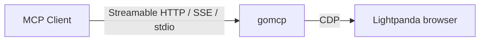

# Lightpanda Go MCP server

`gomcp` is an [MCP server](https://modelcontextprotocol.io) written in
[Go](https://go.dev/).

It exposes tools to interact with [Lightpanda Browser](https://lightpanda.io/)
via [CDP protocol](https://chromedevtools.github.io/devtools-protocol/).



## Installation

### Requirements

`gomcp` requires you to have already installed [Lightpanda
Browser](https://lightpanda.io/docs/getting-started/installation).

### Build from source

You need to install [Go](https://go.dev/doc/install) to build from source.

Once you have cloned the repository, build the binary with `go build`.

## Usage

By default, `gomcp` starts a local instance of Lightpanda browser.

On the first run, you need to download the binary with the command:
```
$ gomcp download
```
The browser is stored in the user config directory.
`$XDG_CONFIG_HOME/lightpanda-gomcp` or `HOME/.config/lightpanda-gomcp` on
Linux, `$HOME/Library/Application Support/lightpanda-gomcp` on Macosx.

You can remove the downloaded binary with `gomcp cleanup` command.

You can connect on a remote browser with the option `--cdp`.
```
$ gomcp -cdp ws://127.0.0.1:9222 stdio
```

###  Configure Claude Desktop

You can configure `gomcp` as a source for your [Claude
Desktop](https://claude.ai/download).

Claude Desktop uses the
[stdio](https://modelcontextprotocol.io/docs/concepts/transports#standard-input%2Foutput-stdio)
transport to connect to an MCP server.

Edit the `claude_desktop_config.json` configuration file and add `gomcp` as the mcp
server **and restart Claude Desktop**.

```json
{
  "mcpServers": {
    "lightpanda": {
      "command": "/path/to/gomcp",
      "args": ["stdio"]
    }
  }
}
```

The model context protocol website gives a way to find
[claude_desktop_config.json](https://modelcontextprotocol.io/quickstart/user#2-add-the-filesystem-mcp-server)
file.

### Standard input/output (stdio)

You can start `gomcp` as a
[stdio](https://modelcontextprotocol.io/docs/concepts/transports#standard-input%2Foutput-stdio).

```
$ ./gomcp stdio
```

### Server-Sent Events (SSE)

You can start `gomcp` as a
[SSE](https://modelcontextprotocol.io/docs/concepts/transports#server-sent-events-sse).

By default, the server listens to the HTTP connection at `127.0.0.1:8081`.

```
$ ./gomcp sse
2025/05/06 14:37:13 INFO server listening addr=127.0.0.1:8081
```

### Streamable HTTP (MCP 2025-03-26+)

The `sse` command also enables the [Streamable HTTP](https://modelcontextprotocol.io/specification/2025-03-26/basic/transports)
transport on the `/mcp` endpoint. This is the recommended transport for remote MCP servers.

The Streamable HTTP transport supports:
- **POST** `/mcp` — Send JSON-RPC requests (`initialize`, `tools/list`, `tools/call`, `ping`, etc.)
- **GET** `/mcp` — Open an SSE stream for server-initiated notifications
- **DELETE** `/mcp` — Close a session

Session management is handled via the `Mcp-Session-Id` header.

```
$ ./gomcp sse
2025/05/06 14:37:13 INFO server listening addr=127.0.0.1:8081
# Streamable HTTP endpoint: http://127.0.0.1:8081/mcp
# Legacy SSE endpoint:      http://127.0.0.1:8081/sse
```

Example client configuration (for MCP clients supporting Streamable HTTP):
```json
{
  "mcpServers": {
    "lightpanda": {
      "url": "http://127.0.0.1:8081/mcp"
    }
  }
}
```

## MCP Protocol

This server implements MCP protocol version `2025-03-26`, supporting:
- `initialize` / `notifications/initialized` — Handshake and capability negotiation
- `tools/list` and `tools/call` — Tool discovery and invocation
- `ping` — Keepalive / connectivity check
- `resources/list` and `prompts/list` — Empty responses (no resources/prompts)
- `notifications/cancelled` — Request cancellation
- Session management via `Mcp-Session-Id` header

### Available Tools

| Tool | Description | Required Params |
|------|-------------|----------------|
| `goto` | Navigate to a URL and load the page | `url` |
| `search` | Search via DuckDuckGo | `text` |
| `markdown` | Get page content as Markdown | — |
| `links` | Extract all links from the page | — |
| `over` | Signal task completion with result | — |

## Thanks

`gomcp` is built thanks of open source projects, in particular:
* [Go language](https://go.dev)
* [Chromedp](https://github.com/chromedp/chromedp)
* [JohannesKaufmann/html-to-markdown](github.com/JohannesKaufmann/html-to-markdown)
* [Lightpanda Browser](https://github.com/lightpanda-io/browser)
