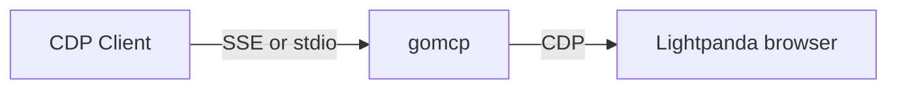

# Lightpanda Go MCP server

---

:warning: This project was a first experiment to expose an MCP for
[Lightpanda Browser](https://lightpanda.io/).
But now, the browser embed an MCP server natively.
More details in the [native MCP blog
post](https://lightpanda.io/blog/posts/lp-domain-commands-and-native-mcp#native-mcp-server).

---

`gomcp` is an [MCP server](https://modelcontextprotocol.io) written in
[Go](https://go.dev/).

It exposes tools to interact with [Lightpanda Browser](https://lightpanda.io/)
via [CDP protocol](https://chromedevtools.github.io/devtools-protocol/).


```mermaid
flowchart LR;
  A[CDP Client]-->|SSE or stdio|gomcp;
  gomcp-->|CDP|B[Lightpanda browser];
```

## Installation

### Requirements

`gomcp` requires you to have already installed [Lightpanda
Browser](https://lightpanda.io/docs/getting-started/installation).

### Build from source

You need to install [Go](https://go.dev/doc/install) to build from source.

Once you have cloned the repository, build the binary with `go build`.

## Usage

By default, `gocmp` starts a local instance of Lightpanda browser.

On the first run, you need to download the binary with the command:
```
$ gomcp download
```
The browser is stored in the user config directory.
`$XDG_CONFIG_HOME/lightpanda-gomcp` or `HOME/.config/lightpanda-gomcp` on
Linux, `$HOME/Library/Application Support/lightpanda-gomcp` on Macosx.

You can remove the downloaded binary with `gomcp cleanup` command.

You can connect on a remote browser with the option `--cdp`.
```
$ gomcp -cdp ws://127.0.0.1:9222 stdio
```

###  Configure Claude Desktop

You can configure `gomcp` as a source for your [Claude
Desktop](https://claude.ai/download).

Claude Desktop uses the
[stdio](https://modelcontextprotocol.io/docs/concepts/transports#standard-input%2Foutput-stdio)
transport to connect to an MCP server.

Edit the `claude_desktop_config.json` configuration file and add `gomcp` as the mcp
server **and restart Claude Desktop**.

```json
{
  "mcpServers": {
    "lightpanda": {
      "command": "/path/to/gomcp",
      "args": ["stdio"]
    }
  }
}
```

The model context protocol website gives a way to find
[claude_desktop_config.json](https://modelcontextprotocol.io/quickstart/user#2-add-the-filesystem-mcp-server)
file.

### Standard input/output (stdio)

You can start `gomcp` as a
[stdio](https://modelcontextprotocol.io/docs/concepts/transports#standard-input%2Foutput-stdio).

```
$ ./gomcp stdio
```

### Server-Sent Events (SSE)

You can start `gomcp` as a
[SSE](https://modelcontextprotocol.io/docs/concepts/transports#server-sent-events-sse).

By default, the server listens to the HTTP connection at `127.0.0.1:8081`.

```
$ ./gomcp sse
2025/05/06 14:37:13 INFO server listening addr=127.0.0.1:8081
```
## Thanks

`gomcp` is built thanks of open source projects, in particular:
* [Go language](https://go.dev)
* [Chromedp](https://github.com/chromedp/chromedp)
* [JohannesKaufmann/html-to-markdown](github.com/JohannesKaufmann/html-to-markdown)
* [Lightpanda Browser](https://github.com/lightpanda-io/browser)
